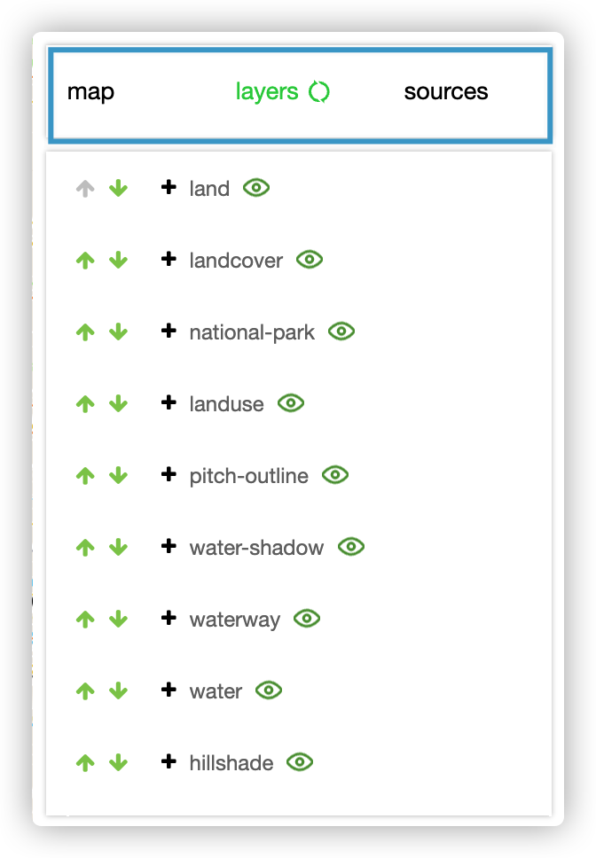
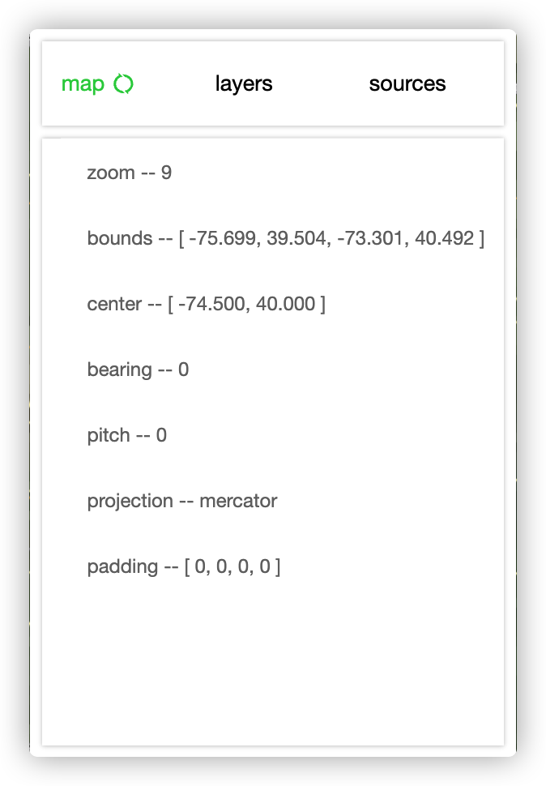
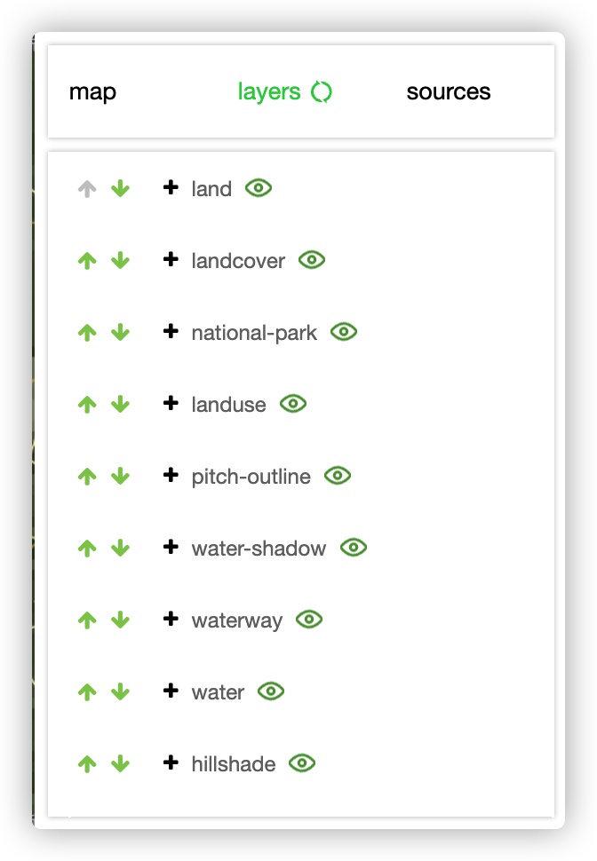
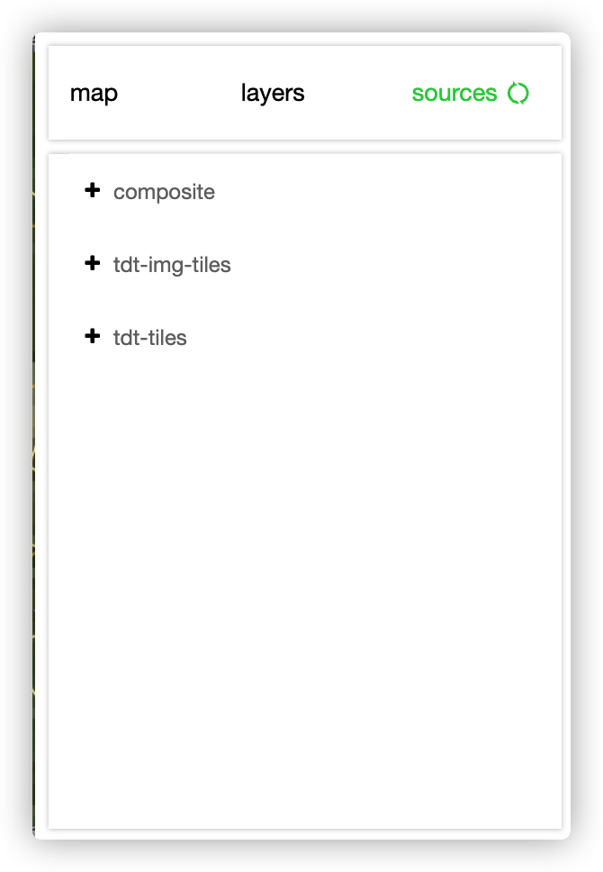

## mapbox devtool




You can drag the whole window in the blue box. Click the Refresh button to update the current page.
### usage

``` bash
yarn add @automan-component/mapbox-devtool
```

```js
import mapboxDevtool from '@automan-component/mapbox-devtool';
...
const map = new mapboxgl.Map({
	...
});
map.addControl(
	new mapboxDevtool()
);

```

### map




You can modify the data on the Map page, and press the Enter key to execute it after you finish entering.

### layers




You can click on the arrows to modify the position of a layer, and click on the eye icon to show or hide a layer.

### sources


